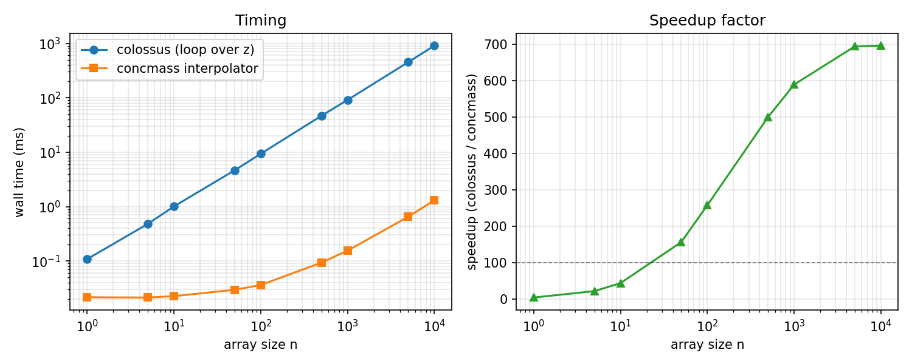
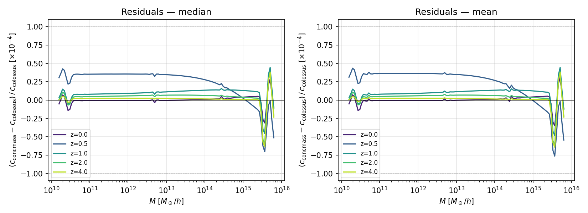

# concmass

Fast halo concentration interpolator built from [Colossus](https://bdiemer.bitbucket.io/colossus/) models. Cubic interpolation on a pre-built in-memory grid gives ~1e-4 relative precision vs. direct Colossus calls, at 100–700× lower cost.

## Install

```
pip install -e .
```

## Usage

```python
from concmass import conc
from concmass.build_tables import build_table
import numpy as np

# build an interpolator (Planck18 + diemer19 median by default)
table = build_table()
table_mean = build_table(statistic="mean")

# scalar or array, any supported model
c = conc("diemer19", 1e13, 0.5, table)
c = conc("diemer15", np.logspace(11, 15, 100), 1.0, table_mean)
```

Supported models (all Colossus model IDs):

```python
from concmass import MODELS
# ['bullock01', 'duffy08', 'klypin11', 'prada12', 'bhattacharya13',
#  'dutton14', 'diemer15_orig', 'diemer15', 'klypin16_m', 'klypin16_nu',
#  'ludlow16', 'child18', 'diemer19', 'ishiyama21']
```

## Building tables

Pass any astropy cosmology object. `sigma8` and `ns` must be provided explicitly — astropy cosmology objects do not carry power-spectrum parameters.

```python
from astropy.cosmology import WMAP9
from concmass.build_tables import build_table

table = build_table(WMAP9, sigma8=0.817, ns=0.9608, model="duffy08", mdef="200c",
                    z_range=(0.0, 2.0))   # duffy08 valid only to z=2
```

For models with restricted validity ranges, pass `M_range` and/or `z_range` to avoid invalid grid points. Default grid is M ∈ [1e10, 1e16] M☉/h, z ∈ [0, 5], 80×40 points.

## Performance

Cubic spline interpolation on an 80 × 40 (log M, z) grid. Colossus only accepts scalar z so it must loop over redshifts; the interpolator vectorises natively over arbitrary (M, z) arrays.



## Precision

Max relative error vs. direct Colossus calls is ~1e-4 across the full grid.



## Tests

```
pytest tests/
```
